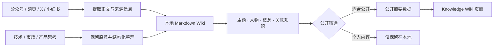

# Sehuri Knowledge Wiki

一个把公开内容、工作知识和个人思考持续沉淀为**可搜索、可关联、可追溯**知识资产的个人 Wiki。

[在线浏览](https://sehuri.github.io/Sehuri-knowledge-wiki/) · [GitHub 仓库](https://github.com/Sehuri/Sehuri-knowledge-wiki)

> GitHub 公开版本只包含经过筛选的摘要、核心观点、主题、人物、概念及条目关联；本地来源摘录、个人想法、提取日志和凭据不会进入公开仓库。

## 当前知识库概览

| 维度 | 当前规模 | 说明 |
| --- | ---: | --- |
| 知识条目 | 29 | 经过结构化整理的公开内容 |
| 内容来源 | 4 类 | 微信公众号 18、网页 9、X 1、小红书 1 |
| 主题 | 69 | 用于跨文章聚合知识 |
| 人物 | 57 | 连接作者、研究者与观点来源 |
| 概念 | 269 | 构成可检索的认知坐标 |
| 产品经理专题 | 4 | Nginx、Gateway、数据库、Redis |

## 知识库结构

```text
Sehuri Knowledge Wiki
├── 综合知识库
│   ├── 内容条目：文章摘要、核心观点与原始来源
│   ├── 主题：跨条目聚合相同议题
│   ├── 人物：连接作者、研究者与观点来源
│   ├── 概念：建立术语与认知坐标
│   └── 关联知识：在相关条目之间双向跳转
│
└── 产品经理 Wiki
    ├── 产品方法：需求、策略、指标、方案与交付
    ├── 技术通识：Nginx、Gateway、数据库、Redis
    ├── 市场与商业：市场判断、竞品、增长与商业模型
    └── 实践与思考：工作现场的判断、复盘与方法沉淀
```

产品经理 Wiki 当前先完成技术通识底图，帮助产品经理从一次用户请求出发，理解请求如何依次经过 **Nginx → Gateway → 业务服务 → 数据库 / Redis**，以及每一层会影响哪些产品体验、系统风险和需求决策。

## 核心功能

| 功能 | 能做什么 |
| --- | --- |
| 多来源内容归档 | 接收微信公众号、网页、X、小红书等公开链接并统一整理 |
| 结构化知识提取 | 为每条内容保留摘要、核心观点、主题、人物、概念、来源与完整度 |
| 全局搜索 | 按标题、摘要、主题、人物和概念快速定位内容 |
| 来源与主题筛选 | 按内容平台或主题缩小知识范围 |
| 知识详情阅读 | 查看摘要、核心观点、原始来源及关联条目 |
| 关系图谱 | 从高频主题和概念进入相关知识集合 |
| 产品经理专题 | 按产品方法、技术通识、市场与商业、实践与思考组织专业知识 |
| 产品决策辅助 | 每个技术专题包含心智模型、必备知识、评审问题、常见误区和官方资料 |
| 隐私分层 | 本地完整知识与公开摘要分开生成，避免个人内容被意外发布 |

## 页面组成

### 1. 综合知识库

- 展示全部公开知识条目及当前统计信息。
- 支持全文关键词搜索、来源筛选和主题筛选。
- 点击条目可查看摘要、核心观点、来源信息和关联知识。
- 通过主题、人物与概念，把零散内容组织成可继续探索的知识网络。

### 2. 产品经理 Wiki

- 提供「产品方法、技术通识、市场与商业、实践与思考」四类知识入口。
- 支持专题搜索和分类筛选。
- 用请求链路图解释系统组件之间的关系。
- 当前内置 Nginx、Gateway、数据库、Redis 四套产品经理技术基础知识。
- 每个专题均包含需求评审时需要追问的问题，方便直接用于方案讨论。

### 3. 关系图谱

- 汇总高频主题与核心概念。
- 点击节点即可回到对应知识集合。
- 用关联关系代替单纯的文件夹层级，帮助发现跨内容联系。

## 内容如何进入 Wiki



整理过程坚持三层分离：

1. **来源内容**：保留原始链接、作者、时间和提取完整度。
2. **AI 整理**：生成摘要、核心观点、标签与关联建议。
3. **个人思考**：保持用户原意，单独保存，不默认进入公开版本。

## 仓库结构

```text
.
├── app/
│   ├── KnowledgeGarden.tsx        # 综合知识库与关系图谱
│   ├── ProductManagerWiki.tsx     # 产品经理 Wiki
│   └── globals.css                # 页面视觉与响应式布局
├── pages/
│   ├── main.tsx                   # GitHub Pages 入口
│   ├── wiki-public-data.ts        # 生成的公开知识数据
│   └── product-manager-wiki-data.ts
├── scripts/
│   ├── sync-public-wiki.mjs       # 生成脱敏后的公开摘要
│   ├── sync-product-manager-wiki.mjs
│   └── publish-wiki.mjs           # 发布辅助脚本
├── tests/                          # 服务端渲染与数据接线测试
├── .github/workflows/              # GitHub Pages 自动部署
└── .openai/hosting.json            # Sites 托管配置
```

> `wiki-public-data.ts` 和 `product-manager-wiki-data.ts` 都是生成文件，应修改本地 Wiki 源数据后重新同步，不要直接手工编辑。

## 本地运行

环境要求：Node.js `>=22.13.0`

```bash
npm ci
npm run dev
```

构建并预览 GitHub Pages 版本：

```bash
npm run prepare:pages
npx vite preview --outDir pages-dist
```

运行完整构建与测试：

```bash
npm test
```

## 内容同步与发布

本地 Wiki 更新后，生成适合公开的知识数据：

```bash
npm run sync:public
npm run build:pages
```

确认生成结果不包含私人内容后，提交相关公开数据并推送到 `main`。GitHub Actions 会自动构建并部署 GitHub Pages。

## 隐私边界

以下内容不会进入 GitHub 公开版本：

- 本地保存的来源全文或长摘录
- 用户的私人想法与工作记录
- 内容提取日志、失败信息和调试数据
- Cookie、令牌、账号信息或其他凭据

公开页面只消费经过筛选的结构化摘要数据；本地完整 Wiki 与公开展示层始终保持分离。
